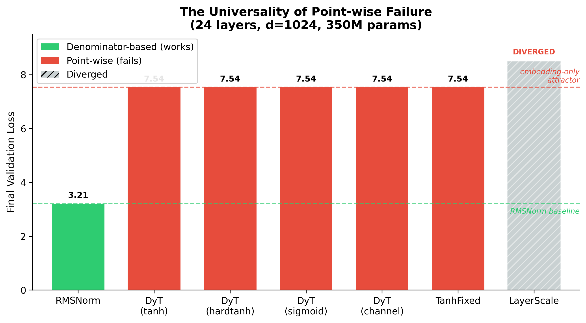
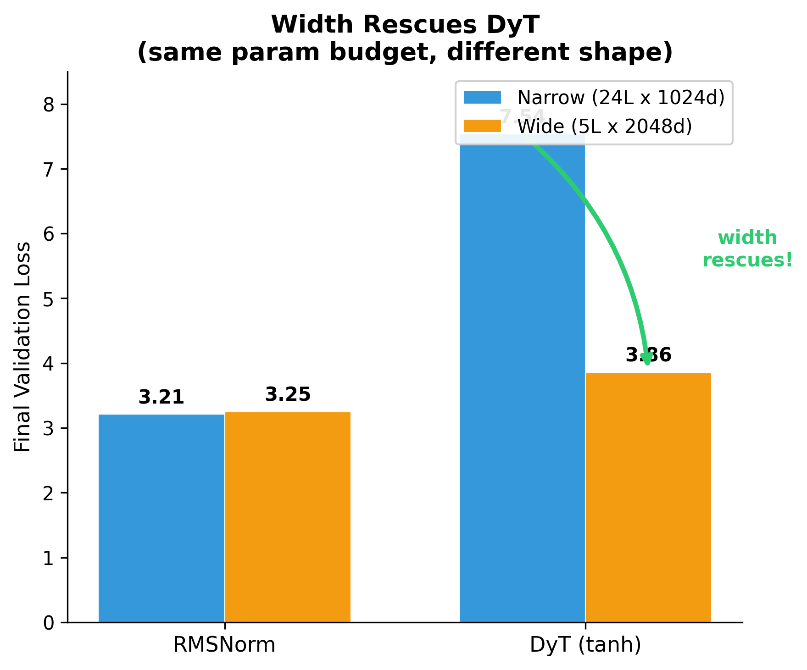
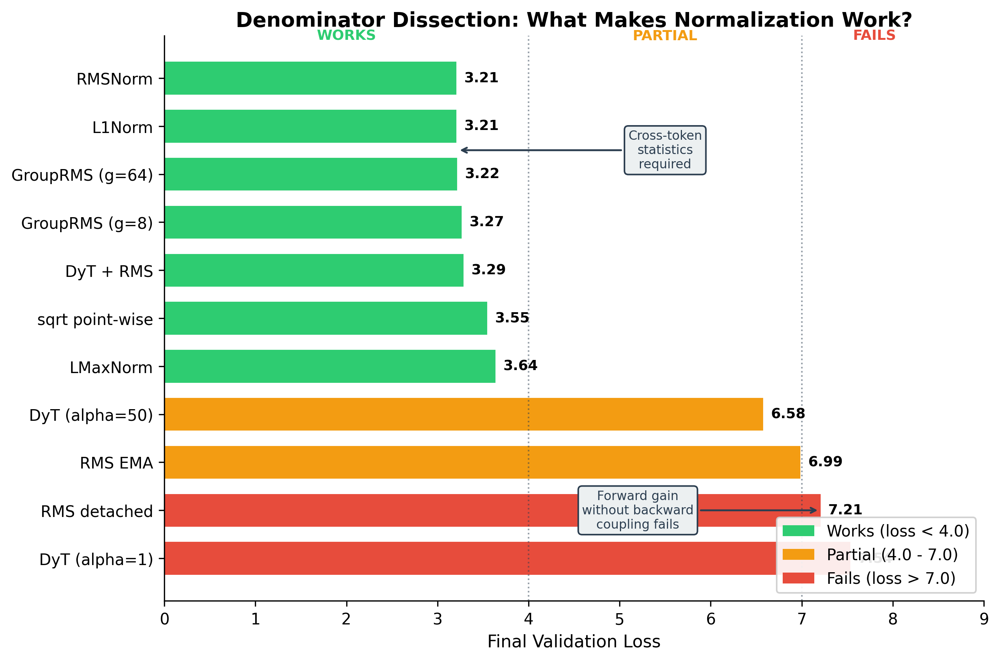
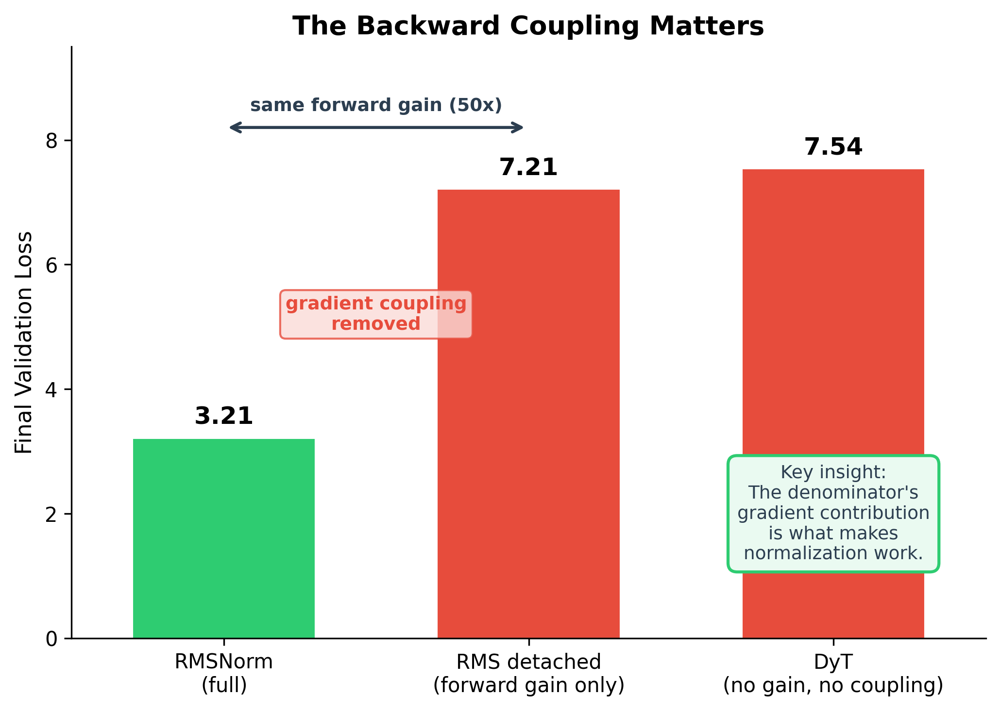
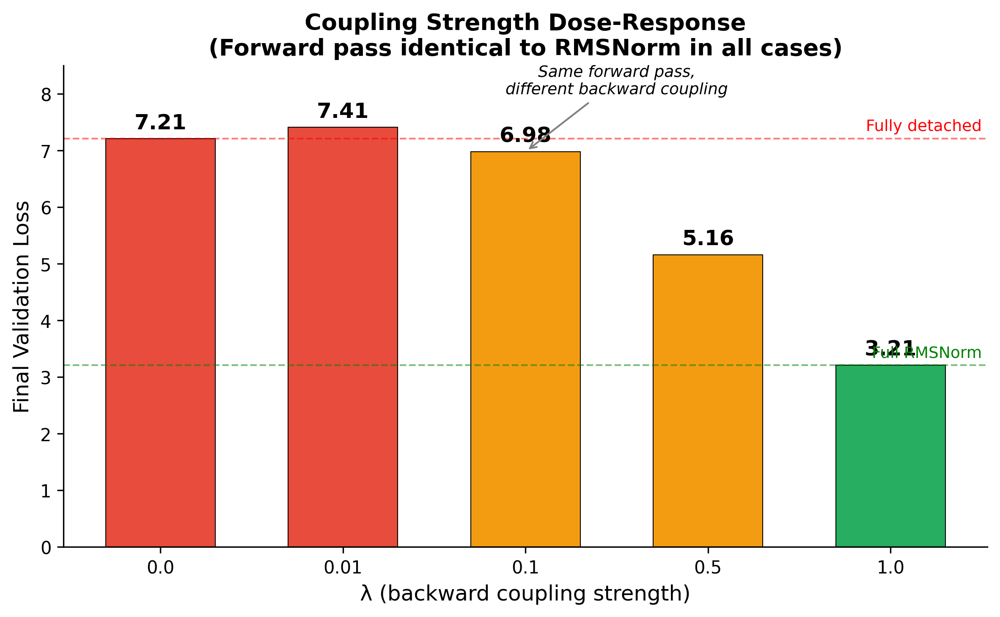
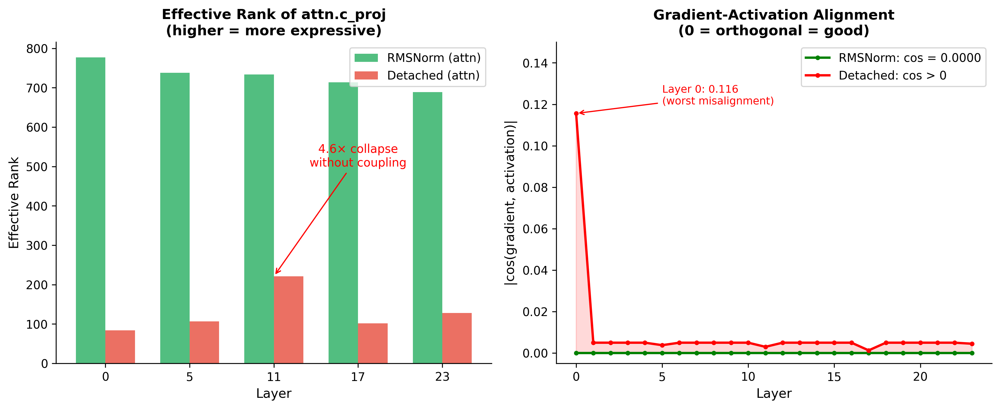

*An empirical dissection of normalization in transformers.*

## The question

The DyT paper ([Zhu et al., 2025](https://arxiv.org/abs/2503.10622), *Transformers without Normalization*) proposes replacing RMSNorm with $\gamma \cdot \tanh(\alpha x) + \beta$, a purely element-wise function. They show it works at LLaMA 7B to 70B scale.

We asked: what is RMSNorm actually doing that a point-wise function can't? Is it the rescaling? The squashing? Or something deeper?

We ran 20+ experiments on 360M-param transformers, dissecting every component of normalization. Here's what we found.

## A tale of two normalizers

Before the experiments, let's set up the math. RMSNorm and DyT both take a vector $x$ of dimension $d$ and produce an output of the same shape. But their internal mechanics are fundamentally different.

**RMSNorm** computes a *global statistic* over all $d$ channels, then divides:

$$
\mathrm{RMSNorm}(x)_i \;=\; \gamma_i \cdot \frac{x_i}{r}, \qquad
r \;=\; \sqrt{\tfrac{1}{d}\sum_{j=1}^{d} x_j^2 + \varepsilon}.
$$

Every output channel sees the same denominator $r$, which depends on *all* input channels. This is the "coupling": channel $i$'s output depends on channels $1, 2, \ldots, d$ through the shared denominator.

**DyT** ([Zhu et al., 2025](https://arxiv.org/abs/2503.10622)) applies a scalar function independently to each channel:

$$
\mathrm{DyT}(x)_i \;=\; \gamma_i \cdot \tanh(\alpha\, x_i) + \beta_i.
$$

Channel $i$'s output depends *only* on $x_i$. No channel ever sees its neighbors. This is "point-wise": each dimension is processed in isolation.

The question is whether this difference matters for training.

## The forward gain problem

Define the **forward gain** of a normalizer at input scale $\sigma$:

$$
G(\sigma) \;=\; \mathbb{E}\!\left[\,\frac{\|N(x)\|_2}{\|x\|_2}\,\right],
\qquad x \sim \mathcal{N}(0,\, \sigma^2 I_d).
$$

This measures how much the normalizer amplifies (or attenuates) the input magnitude.

**Theorem 1 (Point-wise gain is bounded).** For any point-wise norm $N(x)_i = f(x_i)$ with $f(0) = 0$ and finite $f'(0)$:

$$
\lim_{\sigma \to 0} G(\sigma) \;=\; |f'(0)|.
$$

*Proof.* Taylor-expand: $f(x_i) = f'(0)\,x_i + O(x_i^2)$. Then $\|N(x)\|^2 = f'(0)^2 \|x\|^2 + \text{higher-order}$, so the ratio converges to $|f'(0)|$ as $\sigma \to 0$.

The gain is a fixed constant determined by the function's local slope at zero. It does not depend on $d$. It cannot adapt to the input magnitude.

**Theorem 2 (RMSNorm gain is unbounded and adaptive).** For RMSNorm with $\gamma = 1$:

$$
G(\sigma) \;=\; \frac{\sqrt{d}}{\sqrt{\sigma^2 + \varepsilon}} \;\longrightarrow\; \frac{1}{\sigma}
\quad\text{as}\quad \varepsilon \to 0.
$$

*Proof.* $\|N(x)\|^2 = \|x\|^2 / (\mathrm{mean}(x^2) + \varepsilon) \approx d$ when $\sigma^2 \gg \varepsilon$. So $\|N(x)\| \approx \sqrt{d}$ while $\|x\| \approx \sigma\sqrt{d}$. Ratio $= 1/\sigma$.

RMSNorm's gain is **inversely proportional to input scale**: small inputs get amplified more, large inputs get attenuated. This is automatic, per-token, and requires no learning.

**The fundamental trade-off.** A point-wise function cannot have both:

- (a) unbounded gain at small inputs (needs $|f'(0)| \to \infty$)
- (b) bounded output at large inputs (needs saturation, which forces $|f'(0)|$ finite)

RMSNorm sidesteps this because its gain is **data-dependent** ($1/\|x\|$), not a property of a fixed scalar function. The denominator's sum over $d$ channels is what makes this possible.

### What this means at init

With standard GPT-2 init ($\mathrm{wte} \sim \mathcal{N}(0, 0.02)$), the residual stream entering block 0 has std $\approx 0.02$. Plugging into the gain formulas:

- **RMSNorm**: $G(0.02) = 1/0.02 = 50$. Output std $\approx 1.0$.
- **DyT** ($\alpha = 1$): $G(0.02) = |f'(0)| = 1$. Output std $\approx 0.02$.

The two layers receive signals whose magnitudes differ by a factor of 50, and the consequences cascade through every downstream operation in the block.

Consider what attention does with these inputs. After the input is projected to queries and keys, the attention logit for a (query, key) pair is the dot product $q \cdot k = \sum_h q_h k_h$. With independent components of standard deviation $s$, this dot product has variance proportional to $s^2$, so the *spread* of attention logits across positions scales as $s^2$. RMSNorm feeds in $s \approx 1$, producing logits with $O(1)$ spread, exactly the regime softmax was designed for. DyT feeds in $s \approx 0.02$, producing logits with spread $\approx 0.02^2 = 4 \times 10^{-4}$, roughly **2500 times smaller**. After softmax, those logits are indistinguishable, and the attention distribution collapses to nearly uniform $1/T$ over all $T$ positions in the context.

A nearly uniform attention pattern means each token receives essentially the average of its context, weighted equally. There is no selection happening, no information being routed; the attention output is approximately a constant vector independent of the query. Gradients flowing back through this layer have very little structure to learn from, because the layer is computing a near-constant function of its input regardless of the parameter values. The MLP downstream sees a similarly tiny input ($s \approx 0.02$) and, for the same reason, produces a near-linear output with no useful nonlinearity engaged. Both sublayers contribute almost nothing to the residual stream.

Now consider the residual update: $x_{\ell+1} = x_\ell + \mathrm{Block}(x_\ell)$. If the block output is essentially zero, the residual stream just propagates the embedding layer's activations forward, layer after layer, unchanged. The model effectively reduces to a linear function of the token embeddings followed by the unembedding head. In practice, training converges to a loss equal to the entropy of the unigram distribution: the model has learned to predict tokens based on their frequency alone, with no contribution from context. This is the "embedding-only attractor" we'll see numerically below at loss 7.54.

## Result 1: Point-wise norms universally fail at narrow width

We replaced RMSNorm with six different point-wise functions at width 1024 (24 layers). **Every single one converges to the exact same loss, to four decimal places.**

| Point-wise variant | $f(x)$ | Final loss |
|---|---|---|
| DyT (tanh) | $\gamma\,\tanh(\alpha x) + \beta$ | 7.5422 |
| DyT (hardtanh) | $\gamma\,\mathrm{hardtanh}(\alpha x) + \beta$ | 7.5422 |
| DyT (sigmoid) | $\gamma\,(2\sigma(\alpha x) - 1) + \beta$ | 7.5424 |
| DyT (per-channel alpha) | $\gamma\,\tanh(\alpha_c x) + \beta$ | 7.54 |
| TanhFixed (no alpha) | $\gamma\,\tanh(x)$ | 7.54 |
| LayerScale (linear) | $\gamma\,x + \beta$ | NaN (diverged) |
| **RMSNorm** | $\gamma\,x / \mathrm{rms}(x)$ | **3.21** |

The 4-decimal agreement across five different squashing functions is the empirical confirmation of Theorem 1: since all have $|f'(0)| \approx 1$, they all produce the same gain, the same dead-block pathology, and the same embedding-only attractor at 7.54. The specific shape of $f$ is irrelevant.

## Result 2: Width matters, but why?

Same param count (~360M), different shape:

| Config | RMSNorm | DyT | Gap |
|---|---|---|---|
| Narrow (24×1024) | 3.21 | 7.54 | **4.33** |
| Wide (5×2048) | 3.25 | 3.86 | **0.61** |

Doubling the width closes the gap by a factor of 7. To see why, we have to track what happens to the residual stream's magnitude as we move through layers, and then ask when (if ever) that magnitude grows large enough to push DyT out of its useless linear regime.

**The signal scale grows layer by layer.** At every block, the residual stream gets an additive update: $x_{\ell+1} = x_\ell + \mathrm{Block}(x_\ell)$. If the block's output is independent of $x_\ell$ (a reasonable approximation at init), then variances add: $\mathrm{Var}(x_{\ell+1}) = \mathrm{Var}(x_\ell) + \mathrm{Var}(\mathrm{Block})$. So the std of the residual stream grows roughly as $\sqrt{\ell}$ in the number of layers, assuming each block contributes a constant amount.

But how much does each block contribute? That's where width enters. A block's output passes through `c_proj`, a linear map from intermediate dimension back into $d_\text{model}$. Standard GPT-2 init draws `c_proj` weights from $\mathcal{N}(0, (0.02/\sqrt{2N_\text{layers}})^2)$. Two effects then compound:

1. **`c_proj` init std.** For the deep model ($N = 24$): $0.02/\sqrt{48} \approx 0.0029$. For the shallow model ($N = 5$): $0.02/\sqrt{10} \approx 0.0063$. The shallow model's block-output weights start about 2.2x larger.
2. **Width amplification through MLP.** The block's output is roughly $\mathrm{c\_proj} \cdot \mathrm{activations}$, and the activations are themselves a function of $d$-dimensional inputs. Sum-over-channels gives a $\sqrt{d}$ factor. Width 2048 gives a $\sqrt{2}$ boost over width 1024.

Multiplying these gives the wide model's residual stream growing roughly 3x faster per layer in std. Add the layer-count effect ($\sqrt{\ell}$), and after a handful of layers the signal at width 2048 has grown into the range where $|\alpha x|$ exceeds the linear regime of $\tanh$ (roughly $|\alpha x| \gtrsim 0.5$). Once you're in the bend region of $\tanh$, the derivative starts to differ meaningfully from the constant $\alpha$, gradients carry information about $x$, and the block starts to actually learn.

At width 1024 with 24 layers and standard init, the residual stream never gets large enough within the available depth. The signal stays inside the linear regime of $\tanh$ from block 0 to block 23, every block remains "dead," and the embedding-only attractor wins. At width 2048, the same arithmetic puts the signal into tanh's nonlinear region by mid-network, and training proceeds, although still with a 0.6-nat handicap relative to RMSNorm (because the early layers are still wasted, and the rescue is partial).

This is also why the DyT paper's claims hold at LLaMA scale: by width 4096+ and with their tuned $\alpha$, the signal escapes the linear regime almost immediately. The pathology we see at width 1024 is invisible from a 7B-and-up vantage point.

## The backward pass: where the real action is

Everything above is about the forward pass (gain, signal scale). But our most surprising finding is that **forward gain alone is not sufficient**. To see why, we need to look at what happens during backpropagation.

### The Jacobian of RMSNorm

For $y_i = \gamma_i x_i / r$ where $r = \sqrt{\mathrm{mean}(x^2) + \varepsilon}$, the Jacobian $J_{ij} = \partial y_i / \partial x_j$ decomposes into two terms:

$$
J_{ij} \;=\; \underbrace{\frac{\gamma_i}{r}\,\delta_{ij}}_{\text{diagonal (gain)}}
\;-\; \underbrace{\frac{\gamma_i\, x_i\, x_j}{d\, r^3}}_{\text{rank-1 coupling}}.
$$

The **diagonal term** is what provides the 50x forward gain. It scales each channel by $\gamma_i / r$, the same $1/r$ amplification we computed above.

The **coupling term** is a rank-1 matrix $-(\gamma \odot x)\, x^\top / (d\, r^3)$. It projects out the component of the upstream gradient that is aligned with the current input direction $x$. In other words, it forces the gradient to be **orthogonal to $x$**.

For DyT, the Jacobian is purely diagonal:

$$
J_{ij} \;=\; \alpha\, \gamma_i\, \mathrm{sech}^2(\alpha\, x_i)\, \delta_{ij}.
$$

Zero off-diagonal entries. No coupling. No projection.

### Measured Jacobian norms

We computed these numerically at init (input std $= 0.02$, $\gamma = 1$):

| Width | Norm | $\Vert J_\text{diag} \Vert_F$ | $\Vert J_\text{coupling} \Vert_F$ | $\Vert J_\text{total} \Vert_F$ |
|---|---|---|---|---|
| 1024 | RMSNorm | 1602 | 50 | 1601 |
| 1024 | DyT | 32 | **0** | 32 |
| 2048 | RMSNorm | 2259 | 50 | 2258 |
| 2048 | DyT | 45 | **0** | 45 |

RMSNorm passes ~50x more gradient. DyT's coupling is identically zero. The coupling term itself is only ~3% of the diagonal (50/1602). We'll come back to why this 3% matters so much.

## Result 3: The denominator is everything

To isolate *what* about RMSNorm matters, we tested ten alternatives:

| Norm | What it tests | Loss | Works? |
|---|---|---|---|
| RMSNorm | Baseline | 3.21 | ✓ |
| L1Norm ($x/\mathrm{mean}(\lvert x\rvert)$) | Does it need to be L2? | **3.21** | ✓ |
| GroupRMS (8 channels) | How much coupling? | **3.27** | ✓ |
| DyT+RMS denom | Give DyT back the coupling | **3.29** | ✓ |
| sqrt pointwise ($f'(0)=\infty$) | Infinite gain, no coupling | **3.55** | ✓ |
| LMaxNorm ($x/\max(\lvert x\rvert)$) | Weakest aggregate | **3.64** | ✓ |
| DyT $\alpha=50$ (50x fixed gain) | Match RMSNorm's init gain | **6.58** | ✗ |
| **RMS detached** (no backward grad) | Remove coupling, keep gain | **7.21** | **✗** |
| RMS EMA (running average) | Remove per-token adaptation | **6.99** | ✗ |
| DyT $\alpha=1$ (standard) | No gain, no coupling | **7.54** | ✗ |

Three findings:

**Finding 1: Any dim-aggregate works.** L1Norm matches RMSNorm exactly. The choice of L2 in RMSNorm is historically contingent, not mathematically necessary.

**Finding 2: Even 8 channels suffice.** GroupRMS with groups of 8 (out of 1024) already matches full RMSNorm. You need ~0.8% of channels coupled.

**Finding 3: Fixed 50x gain fails.** DyT with $\alpha=50$ has identical forward gain to RMSNorm at init. Still fails (6.58). This is the first hint that the forward story is incomplete.

## Result 4: The backward coupling is load-bearing

This is the killer experiment.

**RMS detached**: we compute $y = \gamma\, x / \mathrm{rms}(x)$ exactly as in RMSNorm, but call `.detach()` on the denominator. The forward pass is byte-for-byte identical. The activations are identical. The only difference is that during backpropagation, no gradient flows through $\mathrm{rms}(x)$.

| Variant | Forward gain | Backward coupling | Loss |
|---|---|---|---|
| RMSNorm | 50x (adaptive) | **Yes** | 3.21 |
| RMS detached | 50x (adaptive) | **No** | 7.21 |
| DyT ([Zhu et al., 2025](https://arxiv.org/abs/2503.10622)) | 1x (fixed) | No | 7.54 |

**Same forward computation. Same activations. Same scale. +4.0 nats.**

Removing the gradient through the denominator kills training. The full gradient of RMSNorm is:

$$
\frac{\partial \mathcal{L}}{\partial x_i}
\;=\; \underbrace{\frac{\gamma_i}{r}\,\frac{\partial \mathcal{L}}{\partial y_i}}_{\text{diagonal}}
\;-\; \underbrace{\frac{x_i}{d\,r^3}\,\sum_j \gamma_j\, x_j\, \frac{\partial \mathcal{L}}{\partial y_j}}_{\text{coupling}}.
$$

The `.detach()` removes the second term. That second term, the cross-channel coupling through the shared denominator, is the entire difference between "trains" and "broken."

## What the coupling term does mechanistically

The coupling term $-\,(x_i / (d\,r^3)) \cdot \langle \gamma \odot x,\, \partial \mathcal{L}/\partial y \rangle$ does three things:

**1. Gradient orthogonalization.** The term is proportional to $-x_i$, which means it subtracts the component of $\partial \mathcal{L}/\partial x$ that points along $x$. After this subtraction: $\langle \partial \mathcal{L}/\partial x,\, x \rangle = 0$ exactly. The gradient is forced to be orthogonal to the current activation. This prevents "just scale up what you already have" updates and forces the network to explore new representational directions.

**2. Cross-channel information flow.** The inner product $\langle \gamma \odot x,\, \partial \mathcal{L}/\partial y \rangle$ aggregates the loss signal across all $d$ channels into a single scalar, then broadcasts it back to every channel (weighted by $x_i$). If channel 73 has zero local gradient but channel 500 has a strong signal, channel 73 still gets an update via this broadcast.

**3. Implicit rank regularization.** By projecting out the $x$-direction from every gradient update, the coupling term prevents the residual stream from collapsing into a low-rank subspace. Without it, the optimizer preferentially grows the existing dominant directions (since those have the largest gradients), leading to rank collapse.

## The minimal requirements for normalization

From 20+ experiments, the complete decomposition:

| Property | Essential? | Evidence |
|---|---|---|
| Specific norm (L2 vs L1 vs L∞) | **No** | L1 = RMSNorm |
| Full-dim aggregate (all 1024 ch) | **No** | 8 channels suffices |
| Forward gain at init | **No** (surprisingly) | detached has gain, still fails |
| **Backward gradient coupling** | **YES** | detached proves this |
| **Per-token adaptation** | **YES** | EMA proves this |

The minimal effective norm is *any function that (1) aggregates a statistic across $\ge 8$ channels of the hidden dimension, (2) uses it to scale the output, (3) passes gradients through the aggregation, (4) does so per-token.*

L1Norm ($x / \mathrm{mean}(|x|)$) is the simplest instantiation, and it's computationally cheaper than RMSNorm (no squares, no sqrt).

## The theoretical escape hatch

There is ONE point-wise function that partially works: $\mathrm{sign}(x) \cdot \sqrt{|x| + \varepsilon}$.

It achieves loss 3.55, only +0.34 vs RMSNorm, despite having zero channel coupling. Why? Its derivative at zero is infinite: $f'(0) \to \infty$. This gives it unbounded gain at small inputs, sidestepping the bound in Theorem 1 (which assumes finite $f'(0)$).

But it can't fully match RMSNorm because:

- Its gain $\approx 1/(2\sqrt{|x_i|})$ is a function of $|x_i|$ alone.
- RMSNorm's gain $1/r$ is a function of *all* channels jointly.
- When channels have heterogeneous magnitudes (common: attention sinks, outlier features), RMSNorm adapts to the *collective* scale; sqrt-pointwise treats each channel independently.

This confirms that coupling is not strictly *necessary* if you have unbounded gain, but coupling provides something that no per-element gain function can replicate: awareness of the full activation vector's geometry.

## Result 5: Resolving the coupling paradox

The Jacobian coupling term is only ~3% of total gradient norm. Yet removing it (detached) costs 4 nats. How can 3% matter this much?

### The dose-response curve

We implemented `RMSNormPartialCoupling`, a variant where the backward coupling strength is continuously tunable. Mathematically, the effective gradient becomes:

$$
\frac{\partial \mathcal{L}}{\partial x_i}
\;=\; \frac{\gamma_i}{r}\,\frac{\partial \mathcal{L}}{\partial y_i}
\;-\; \lambda \cdot \frac{x_i}{d\,r^3}\,\sum_j \gamma_j\, x_j\, \frac{\partial \mathcal{L}}{\partial y_j}.
$$

At $\lambda=1$ this is full RMSNorm. At $\lambda=0$ this is detached. We swept $\lambda \in \{0, 0.01, 0.1, 0.5, 1.0\}$:

| $\lambda$ (coupling strength) | Final loss | Status |
|---|---|---|
| 0.0 (detached) | 7.21 | broken |
| 0.01 | 7.41 | broken |
| 0.1 | 6.98 | broken |
| 0.5 | 5.16 | impaired |
| 1.0 (full) | 3.21 | works |

Not a phase transition, but a smooth degradation. You need nearly full coupling ($\lambda \approx 1$) to maintain training quality.

### Why: the coupling is a thermostat for gradient direction

We measured two quantities from the trained models:

| Metric | RMSNorm ($\lambda=1$) | Detached ($\lambda=0$) |
|---|---|---|
| **Effective rank (attn c_proj)** | 727 | 158 (4.6x collapse) |
| **Effective rank (mlp c_proj)** | 936 | 195 (4.8x collapse) |
| **$\cos(\text{gradient}, \text{activation})$** | **0.0000** | 0.0084 |

**1. With coupling: gradient is perfectly orthogonal to activation.** $\cos(\partial \mathcal{L}/\partial x,\, x) = 0.0000$, not approximate, exact to four decimals. This is mathematically guaranteed: the coupling term subtracts exactly the $x$-component of the gradient.

**2. Without coupling: rank collapses 5x.** When the gradient can align with the activation, the optimizer only learns to *scale* existing representations. It cannot explore new directions. Weight matrices lose effective rank. Expressivity collapses.

### Resolving the paradox

The coupling term is 3% of gradient **magnitude** per step. But it operates in a specific rank-1 subspace (the $x$-direction) that would otherwise receive *zero* corrective signal. Its importance is not about size; it's about being the **only** source of orthogonality enforcement in the system.

Each optimizer step drifts the gradient slightly toward alignment with $x$ (gradient descent naturally amplifies existing patterns). The coupling term pushes back, a continuous correction. At full strength ($\lambda=1$), drift is exactly canceled: $\cos = 0.0000$. At $\lambda=0.5$, half the correction is missing; drift accumulates over 6860 steps into moderate rank collapse (+2 nats). At $\lambda=0.01$, the correction is negligible and full rank collapse ensues.

The analogy: a thermostat uses a tiny fraction of a room's thermal energy, but running it at 50% power makes the room uninhabitable. The coupling is normalization's thermostat for gradient direction, a small continuous correction that prevents catastrophic drift.

## Summary: What makes RMSNorm work

RMSNorm provides exactly two things that point-wise functions cannot:

**1. Data-dependent forward gain** ($1/r$): automatically amplifies small inputs and attenuates large ones, keeping the signal in a useful range without any learning. Point-wise functions have fixed gain $|f'(0)|$ that cannot adapt.

**2. Backward gradient coupling**: the off-diagonal Jacobian term projects out the $x$-aligned component of the gradient, maintaining perfect orthogonality between updates and current activations, preventing rank collapse. Point-wise functions have zero off-diagonal Jacobian by construction.

Of these two, the backward coupling is the more surprising and more essential finding. Forward gain can be approximated by other means (wider init, sublinear squashers, high $\alpha$). Backward coupling cannot be replicated by any point-wise operation; it requires reading a cross-channel statistic and passing gradients through it.

## Implications

1. **Don't use DyT ([Zhu et al., 2025](https://arxiv.org/abs/2503.10622)) below 2B params.** The paper's claims hold at width $\ge 4096$, not below. At typical small-LLM widths (1024 to 2048) DyT either fails or underperforms significantly.

2. **Normalization's value is NOT "rescaling."** It's the backward gradient coupling through a per-token channel-aggregate. Forward gain helps but is insufficient alone.

3. **The coupling is a direction regulator, not a magnitude effect.** It maintains exact gradient-activation orthogonality, preventing rank collapse. 3% of gradient norm, 5x of effective rank, 4 nats of final loss.

4. **If you want cheaper normalization**, use L1Norm ($x/\mathrm{mean}(|x|)$); it matches RMSNorm at lower compute cost (no squares, no sqrt). Or GroupRMS with small groups.

5. **If you want truly norm-free training**, you need a different mechanism for per-token cross-channel gradient flow. Spectral normalization of weights ($\sigma$-Reparam) or nGPT-style hypersphere constraints are candidates; they achieve coupling through the weight matrix rather than an activation normalization layer.

---

*Experiments: 360M GPT, 20 TPP (7.2B tokens FineWeb-Edu), 8×B200 DDP, AdamW lr=3e-4, AGINanoGPT codebase. All runs completed in $\le$15 minutes per variant on AWS Green HyperPod P6-B200.*

*Reference: Zhu, J., Chen, X., He, K., LeCun, Y., & Liu, Z. (2025). [Transformers without Normalization](https://arxiv.org/abs/2503.10622). arXiv:2503.10622.*
